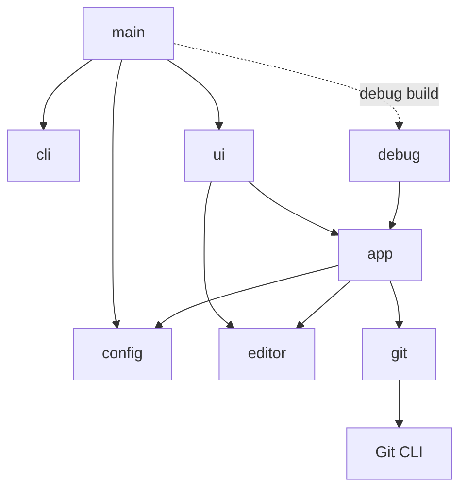

# Architecture

`gitlsd` is a modular terminal application built around the Git CLI. Git owns repository semantics; `gitlsd` provides configuration, application behavior, and presentation.

## Principles

- **Git-based.** Repository data and behavior come from Git commands. `gitlsd` does not reimplement Git.
- **Configuration-driven.** Commands, pagination, and key bindings are runtime policy rather than application behavior.
- **Modular.** Configuration, repository access, application behavior, and presentation have narrow boundaries. Each can evolve or be replaced without redefining the others.
- **Debug mode is the testing foundation.** Interactive and debug frontends use the same application behavior. Scripted input and stable snapshots make the complete path testable without a terminal.

## Modules

- `main` composes the application and selects a frontend.
- `cli` defines startup arguments.
- `config` resolves, creates, and parses runtime policy and input mappings; configured action names are represented by six domain groups: `NavigationAction`, `SearchAction`, `GlobalAction`, `PreviewAction`, `ShowAction`, and `StatusAction`.
- `app` owns application state and behavior. It coordinates user actions and screen transitions independently of terminal rendering and Git process details, retaining per-document file and chunk header indexes and revisions for loaded diffs.
- `editor` expands configured `file` and `line` placeholders and launches the editor directly in the repository root.
- `git` provides repository data through the Git CLI. It runs the optional shared `diff-filter` subprocess on raw diff presentation bytes before terminal sanitization, collecting output while supplying stdin. It indexes recognized Git and delta file and chunk text headers in displayed documents, with strict next/previous chunk lookup independently of rendering; discovery, metadata, file identity, and mutations bypass this filter.
- `ui` is the interactive terminal frontend. It renders show and status modes across the full content area, reuses the content-area aspect-ratio split rule used by the log/preview screen, caches styled terminal-visible document rows by application revision and search query, and suspends the terminal session while an editor runs.
- `debug` is the deterministic scripted frontend used by integration tests; it exposes show and status focus, group, selection, offsets, metadata, file rows, and diff content in stable plain text.

Detailed module responsibilities and implementation contracts are documented in the code.
