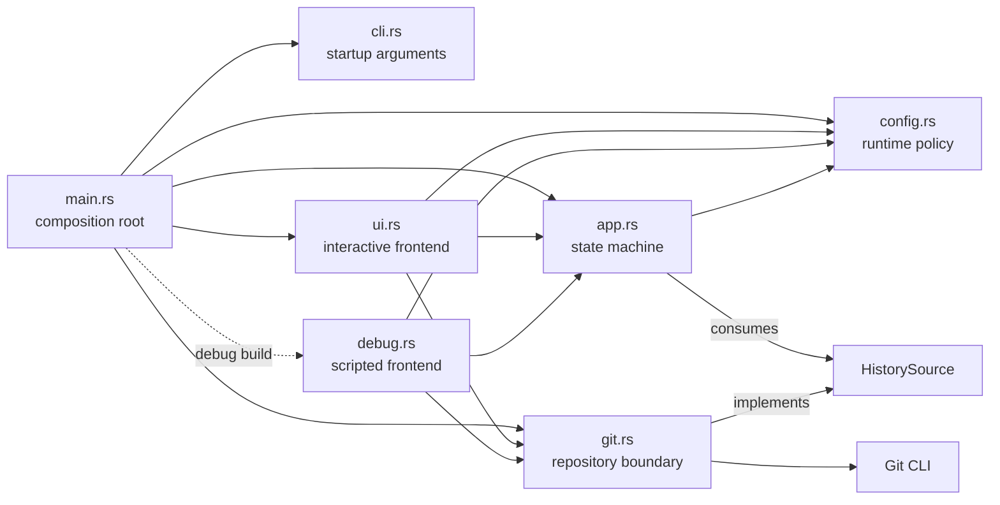

# Architecture

## Introduction

`gitlsd` is a terminal interface for inspecting and interacting with Git logs, status, and diffs. It is a thin orchestration and presentation layer over the installed Git CLI: Git owns repository semantics, while `gitlsd` owns configuration, application state, user interaction, and rendering.

## Philosophy and key principles

- **Git-based and CLI-based.** All repository information comes from Git CLI commands executed directly as argument vectors, without a shell. `gitlsd` does not reimplement repository traversal, revision selection, working-tree semantics, or diff behavior.
- **Configuration-driven.** Git commands, batch sizes, and key bindings are runtime policy supplied by defaults and user configuration. Physical keys resolve to a shared action vocabulary, and the effective configuration is visible from the application.
- **Functional core, imperative shell.** The application state machine owns navigation, screens, search, commands, and incremental loading. Terminal I/O, configuration discovery, environment access, and child processes remain at the edges. Dependencies point inward from frontends and adapters toward state and data abstractions.
- **Debug mode is the testing foundation.** Interactive mode and debug mode drive the same application state machine. Debug mode replaces terminal events with scripted keys and terminal rendering with stable text snapshots, making end-to-end tests deterministic while still exercising configuration and the real Git process boundary. It is available only in debug builds.
- **Frontends are replaceable boundaries.** Ratatui and Crossterm belong to the interactive frontend rather than the application core. A frontend translates input into shared keys and actions, then renders application state; it does not own behavior.
- **Terminal lifecycle is owned at the edge.** The interactive frontend is responsible for entering and restoring terminal state on successful exits and errors. Core behavior remains independent of terminal setup and cleanup.

## Overview

The crate is organized around a central application state machine, a repository abstraction, configuration policy, and two frontends. `main.rs` composes these pieces and selects the frontend; the library modules do not depend on the executable bootstrap.

### Modules

| Module | Responsibility | Relationships |
| --- | --- | --- |
| `main.rs` | Composition root and process-level error handling. Loads CLI arguments and configuration, constructs the Git adapter and application state, then runs the selected frontend. | Depends on all runtime modules; contains no application behavior. |
| `lib.rs` | Declares the library boundary and exposes the runtime modules. | Keeps reusable code outside the executable bootstrap. |
| `cli.rs` | Defines process startup arguments. | Supplies paths and frontend-selection input to `main.rs`; does not mutate application state. |
| `config.rs` | Owns defaults, configuration discovery and parsing, effective settings, and the shared input/action vocabulary. | Produces `Config`; defines `Key` and `Action`, which connect frontends to `App`. |
| `git.rs` | Defines repository data and the history-loading boundary, and adapts configured commands to the Git CLI. | `App` consumes `HistorySource`; `GitHistory` implements it using a child process; `CommitRecord` is the data returned across the boundary. |
| `app.rs` | Owns application state and transitions: screens, input modes, selection, pagination, search, commands, help, and shutdown intent. | Depends on configuration data and `HistorySource`; has no dependency on Ratatui, Crossterm, filesystem discovery, environment access, or concrete process execution. |
| `ui.rs` | Implements the interactive Ratatui/Crossterm frontend and terminal lifecycle. | Translates terminal events into `Key`, dispatches them to `App`, and renders `App` state. |
| `debug.rs` | Implements the deterministic debug frontend. | Translates scripted tokens into the same `Key` values as the interactive frontend, drives `App`, and renders a stable text snapshot. |
| `tests/debug_mode.rs` | Exercises the complete debug-mode path against a pinned Git fixture. | Tests the compiled executable, configuration, shared state machine, and real Git adapter without requiring a TTY. |

### Key abstractions

- `Config` is the resolved runtime policy. `Key` represents frontend-independent input and maps to `Action`, the application command vocabulary.
- `HistorySource` is the application-facing repository port. `GitHistory` implements history and selected-commit preview loading using the Git CLI, while tests can provide deterministic in-memory sources.
- `CommitRecord` pairs a stable commit ID with Git-produced one-line display text. `GitHistory` runs the configured full `git log` argv with pagination and no external pager, then a companion ID-only query with the same selection and pagination. Configuration rejects multiline and expanded output so rows remain selectable commits. Safe ANSI SGR is retained for interactive styling and stripped for search and debug snapshots; other terminal controls are neutralized. Rust does not reconstruct Git presentation fields.
- `App` is the central state machine. It owns preview visibility, focus, content, scrolling, and separate preview search state alongside `Screen` and `InputMode`; frontends observe and drive this state rather than duplicating it.
- `ui::run` and `debug::run_script` are peer frontend entry points over the same `App` and `HistorySource` contracts.
