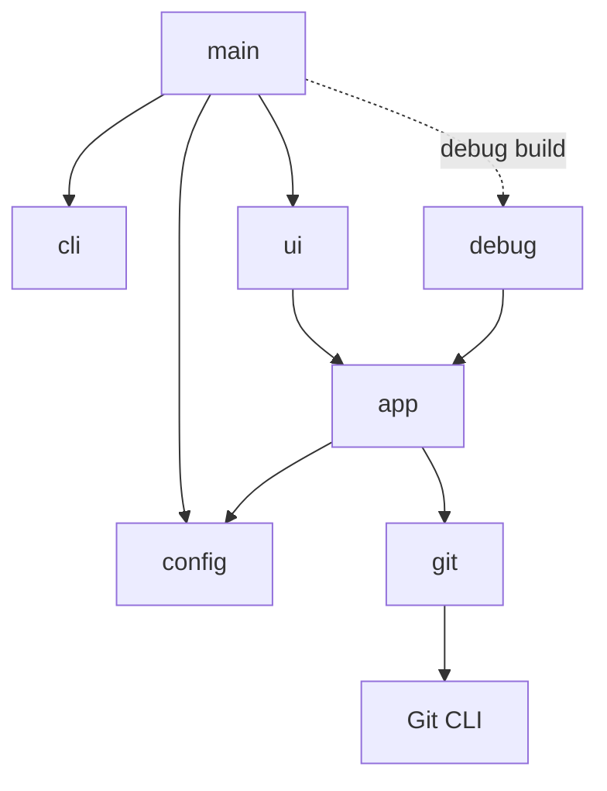

# Architecture

`gitlsd` is a modular terminal application built around the Git CLI. Git owns
repository semantics; `gitlsd` provides configuration, application behavior,
and presentation.

## Principles

- **Git-based.** Repository data and behavior come from Git commands. `gitlsd`
  does not reimplement Git.
- **Configuration-driven.** Commands, pagination, and key bindings are runtime
  policy rather than application behavior.
- **Modular.** Configuration, repository access, application behavior, and
  presentation have narrow boundaries. Each can evolve or be replaced without
  redefining the others.
- **Debug mode is the testing foundation.** Interactive and debug frontends use
  the same application behavior. Scripted input and stable snapshots make the
  complete path testable without a terminal.

## Modules

- `main` composes the application and selects a frontend.
- `cli` defines startup arguments.
- `config` resolves runtime policy and input mappings.
- `app` is the state machine that owns application state and behavior,
  including the log/preview screen and the full-screen show explorer/diff
  screen. Persistent log and preview state survives screen transitions, while
  the active-screen enum exclusively owns ephemeral help or show state. Show
  navigation never mutates the log selection, and diff scrolling keeps the
  explorer selection synchronized with the current patch section.
- `git` provides repository data through the Git CLI. Its `ShowData` result
  keeps metadata, fixed name-status rows, and the complete configured diff
  together so the app cannot render mismatched partial show loads.
- `ui` is the interactive terminal frontend. It renders show mode across the
  full content area and reuses the content-area aspect-ratio split rule used
  by the log/preview screen.
- `debug` is the deterministic scripted frontend used by integration tests;
  it exposes show focus, selection, offsets, metadata, file rows, and diff
  content in stable plain text.

Detailed module responsibilities and implementation contracts are documented
in the code.
